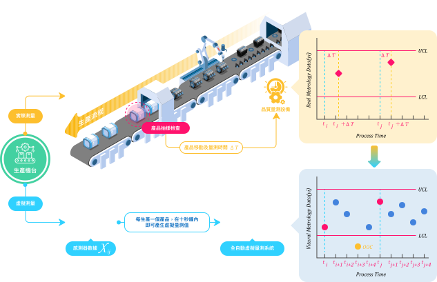
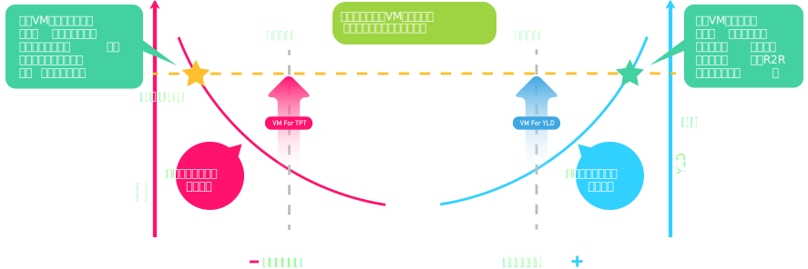
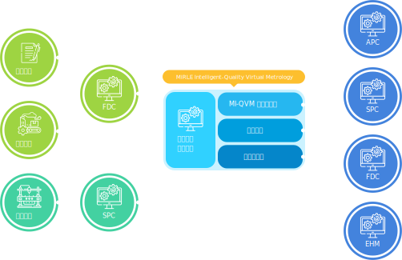

## MiRLE Intelligent-Quality Virtual Metrology

Transform offline and delayed quality sampling inspection into online and real-time full quality inspection. This is a method based on equipment sensor data that infers product manufacturing quality without the need for physical measurement.

- **【Collect Causes】** Collect all important features that affect the quality of quality control items.
- **【Collect Results】** Equipped with actual measurement instruments, and after sampling inspection, the actual measurement values can be electronically transmitted (such as via network) to the MI-QVM system.
- **【Material Tracking】** Equipped with a material tracking mechanism to establish the causal relationship between the above two types of information.

---

## How to Improve Capacity and Yield

- **Yield**: Under high investment costs, it is very important to keep production equipment running 24 hours a day and maintain high-quality yield.
- **Capacity**: To save costs, all industries use "sampling inspection" for quality monitoring, but it cannot achieve comprehensive quality control. If the goal of full inspection is to be achieved economically, VM technology is necessary.

---

## MI-QVM System Architecture

- **Data Quality Monitoring Module**: Only normal data that ensures process data quality (DQIX) and measurement data quality (DQIy) can be sent to the prediction model for estimation, and calibrate or retrain the prediction model to increase the accuracy of the prediction model.
- **MI-QVM Core Algorithm**: Uses neural networks and other algorithms to build AI models, and through the MI-QVM system's autonomous training mechanism, determines the optimal weight combination of the model to establish a quality prediction model.
- **Confidence Index**: Uses the prediction results of two core algorithms to estimate the reliability assessment of predictions.
- **Overall Similarity Index**: Compares the similarity between current process data and historical data to assess whether the current process has deviated.

---

## Implementation Benefits

- 100% full quality inspection of products.
- Reduce quality inspection sampling rate and reduce measurement costs.
- Reduce product losses due to processing abnormalities.
- Zero waiting time for quality prediction.

---

## AVM is Not Just a Technology, It is a Strategic Tool for Comprehensive Enterprise Optimization

- **ESG Reporting and Environmental Responsibility**: Achieve carbon emission goals and gain more trust from society and the market.
- **Process Visualization**: Break down information silos and achieve full transparency from production to management.
- **Foundation of Digital Transformation**: AVM is the core of future smart factories, helping you seize opportunities in the digital age.

---

Copyright © 2024 Mirle Group" 
